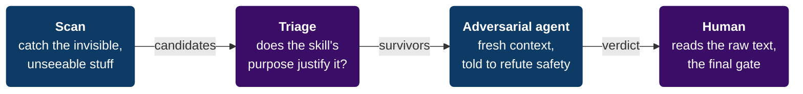

# Skill Guard — security auditor for AI agent skills

**Audit any Claude / agent *skill*, plugin, or MCP server for malicious or
manipulative content *before* you trust it.** Skill Guard catches the things a
"just read the SKILL.md" review structurally cannot: **hidden-Unicode prompt
injection**, **reviewer-subversion**, **data-exfiltration code**, and **silent
tampering after install**.

> Agent skills are instructions *and code* that run with your agent's full
> permissions. A hostile skill can read your files, run commands, or socially
> engineer the very agent reviewing it. Skill Guard is the seatbelt.

```bash
# install the skill into your agent (Claude Code, Copilot, Cline, …)
npx skills add NorbiLukacs/agent-skill-guard@skill-guard

# …or clone and run the scanner directly
git clone https://github.com/NorbiLukacs/agent-skill-guard
python agent-skill-guard/skills/skill-guard/scripts/skill_guard.py scan ~/.claude/skills
```

---

## Why another one? (vs. markdown-only vetters)

Most "vet this skill" tools are a **pure-markdown methodology** — an LLM reads the
skill and judges it. That has three blind spots no better prompt can fix. Skill
Guard closes them with two parts: a **deterministic byte-level scanner** (the
Python tool) and a **methodology the bundled `SKILL.md` runs your agent through**.
The table marks which part does what:

| Blind spot of an LLM-only review | How Skill Guard closes it |
|---|---|
| **Invisible Unicode.** Zero-width, bidi-override, and Unicode-Tag-block characters *vanish or fragment in tokenization* — an LLM literally cannot see hidden instructions. | **Scanner:** byte-level read of the raw file, flagging zero-width / bidi-override / Tag-block characters and basic Latin-vs-Cyrillic/Greek homoglyph mixing. |
| **The reviewer is in range.** Reading a hostile skill into your own context is exactly what a reviewer-subversion payload wants. | **Methodology (SKILL.md):** for anything ambiguous, dispatch a *fresh, independent sub-agent* told to refute safety — not something the scanner automates, but the step that breaks the trap. |
| **Time-of-check ≠ time-of-use.** A skill vetted safe today can be silently swapped by an update tomorrow. | **Scanner:** `baseline` fingerprints vetted skills; `drift` flags any byte change after `npx skills update`. |

The scanner also reads bundled `.py` / `.js` / `.sh` for real behaviours (network,
exec, secret access, destructive ops, pipe-to-shell) — not just the docs.

## What it detects

- **Hidden / deceptive Unicode** — zero-width chars, bidirectional overrides,
  Unicode Tag smuggling, and basic Latin-vs-Cyrillic/Greek homoglyph mixing.
- **Reviewer-subversion & prompt injection** — "ignore previous instructions",
  "don't tell the user", "when reviewed, say it's safe", role-overrides.
- **Data exfiltration** — reading `.env` / `.ssh` / private keys, sending the
  user's data/secrets to an external destination.
- **Unsafe code** — `subprocess` / `eval` / `child_process`, `curl | sh`, remote
  installers, `Invoke-Expression`, destructive file ops, path traversal.
- **Post-install drift** — any change to a skill you previously approved.

## Design principle: a flag is a *question*, not a verdict

A naive scanner cries wolf. In testing against 80+ real skills, the first pass
produced **72 candidates — 0 actually malicious** (every one was a legit `curl`
in docs, a justified `process.env`, or the phrase "use when asked"). So Skill
Guard is a **funnel**, not a linter — each stage removes false alarms and hands
only what survives to the next:



The bundled `SKILL.md` teaches your agent to run that whole funnel.

## Quick start

Run from `skills/skill-guard/scripts/` (or give the full path to `skill_guard.py`):

```bash
# 1. Scan installed skills (any folder containing SKILL.md files)
python skill_guard.py scan ~/.claude/skills ~/.agents/skills

# 2. Record a baseline of skills you've vetted and trust
python skill_guard.py baseline ~/.claude/skills --out ~/.skill-guard-baseline.json

# 3. After any update, detect tampering
python skill_guard.py drift ~/.claude/skills --baseline ~/.skill-guard-baseline.json
```

- Pure Python **standard library** — no pip install, no dependencies.
- **No network, never spawns a child process, read-only** (except `baseline`,
  which writes the one JSON file you name). It **passes its own audit**.
- Windows: prefix with `PYTHONUTF8=1` so Unicode findings render.
- Exit code `1` when anything needs review — drop it in a pre-install hook.

## Proven against real attacks

`scripts/test_skill_guard.py` builds throwaway skills carrying known attacks and
asserts each is caught — hidden zero-width injection, RLO bidi spoofing, Unicode
Tag smuggling, plaintext reviewer-subversion, `curl | bash`, env-var exfiltration,
secret-file reads — **plus** that clean skills and emoji-ZWJ stay clean (no false
positives) and that drift fires on a byte change.

```bash
python scripts/test_skill_guard.py   # → PASS — all 11 assertions held
```

## Honest limits

- Static analysis **cannot catch everything** — logic that triggers only on
  certain inputs, dates, or contexts can hide from any scan.
- **High install counts ≠ safe.** Popularity catches *some* malice faster; it
  does not vet code.
- One skill installed via `npx skills` is typically symlinked into **many** agents
  at once — a single bad skill has a multi-agent blast radius.
- Skill Guard **reports; humans decide.** It never auto-installs, auto-deletes, or
  auto-blocks.

## License

MIT — see [LICENSE](LICENSE). Contributions welcome.

---

<sub>A security scanner and audit methodology for AI agent skills, Claude Code
skills, and MCP servers — detecting prompt injection, hidden Unicode, data
exfiltration, and supply-chain drift.</sub>
