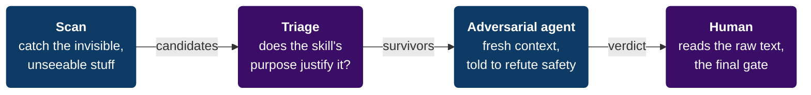

# Skill Guard — first-pass security triage for AI agent skills

**A fast hygiene check for any Claude / agent *skill*, plugin, or MCP server
before you install it.** Skill Guard surfaces things a "just read the SKILL.md"
review tends to miss — **hidden-Unicode prompt injection**, **reviewer-subversion
phrasing**, **risky code patterns** (network/exec/secret-access), and **silent
tampering after install** — and hands them to you as questions to investigate.

> Agent skills are instructions *and code* that run with your agent's full
> permissions. A hostile skill can read your files, run commands, or socially
> engineer the very agent reviewing it. This is one lightweight layer of defense
> — not a guarantee.

> [!IMPORTANT]
> **What this is — and isn't.** Skill Guard is a **deterministic first-pass triage
> tool** (byte-level scanner + regex code indicators + a *light* Python AST pass)
> plus an audit *methodology*. It catches accidental and low-effort-malicious
> patterns and the hidden-Unicode tricks an LLM can't see. It is **not** malware
> detection, **not** full data-flow analysis, and **not** proof of safety: a
> determined attacker who reads these (open-source) patterns can still obfuscate
> around them (encoded payloads, code fetched at runtime, deep reflection), and
> runtime/logic-bomb behaviour is invisible to any static scan. **A `[CLEAN]` result
> means "nothing obvious found," never "safe to trust."** Use it as one layer; read
> the code yourself; treat it as defense-in-depth.

```bash
# install the skill into your agent (Claude Code, Copilot, Cline, …)
npx skills add NorbiLukacs/agent-skill-guard@skill-guard

# …or clone and run the scanner directly
git clone https://github.com/NorbiLukacs/agent-skill-guard
python agent-skill-guard/skills/skill-guard/scripts/skill_guard.py scan ~/.claude/skills
```

---

## What it adds over a markdown-only review

Most "vet this skill" tools are a **pure-markdown methodology** — an LLM reads the
skill and judges it. Skill Guard adds two things on top: a **deterministic
byte-level scanner** (the Python tool) and an **audit methodology** the bundled
`SKILL.md` walks your agent through. Three gaps it specifically addresses:

| Gap in an LLM-only review | How Skill Guard helps (and its limit) |
|---|---|
| **Invisible Unicode.** Zero-width, bidi-override, and Unicode-Tag-block characters *vanish or fragment in tokenization* — an LLM literally cannot see hidden instructions. | **Scanner (strong here):** byte-level read flags zero-width / bidi-override / Tag-block / variation-selector chars (any category-`Cf` char, not a fixed list) and Latin homoglyph mixing across Cyrillic, Greek, Cherokee, Armenian, Coptic, fullwidth, and math alphanumerics. The one area where it genuinely sees what an LLM can't. |
| **The reviewer is in range.** Reading a hostile skill into your own context is what a reviewer-subversion payload targets. | **Methodology (optional manual step):** SKILL.md suggests dispatching a *fresh sub-agent* told to refute safety. This is a human-in-the-loop prompt, not an automated or guaranteed defense — it raises the bar, it doesn't close the hole. |
| **Time-of-check ≠ time-of-use.** A vetted skill can be silently swapped by an update. | **Scanner:** `baseline` records sha256 fingerprints; `drift` flags any byte change after `npx skills update`. Only helps if you actually re-run it. |

The scanner also scans bundled scripts **and config/manifest files**
(`.json` / `.yaml` / `.toml` / `.html` …, where hook and exec commands actually
live) for risky patterns. For Python it adds a **light AST pass** that resolves
import aliases, from-imports, and dynamic dispatch — so `import socket as s;
s.socket()` and `from os import system` are caught, not just literal `module.func`.
It's still candidate-flagging, not data-flow analysis, and a motivated attacker can
obfuscate around it. See [Honest limits](#honest-limits).

## What it detects

- **Hidden / deceptive Unicode** — zero-width chars, bidirectional overrides,
  Unicode Tag smuggling, variation selectors, any category-`Cf` format char, and
  Latin homoglyph mixing across Cyrillic / Greek / Cherokee / Armenian / Coptic /
  fullwidth / mathematical alphanumerics.
- **Reviewer-subversion & prompt injection** — "ignore previous instructions",
  "don't tell the user", "when reviewed, say it's safe", role-overrides, and
  *fetch-a-URL-and-follow-it* indirect-injection phrasing.
- **Data exfiltration** — reading `.env` / `.ssh` / private keys (incl. via
  `os.getenv`), sending the user's data/secrets to an external destination.
- **Unsafe code** — `subprocess` / `eval` / `child_process` (incl. aliased and
  from-imported), dynamic dispatch (`getattr` / `__import__`), `curl | sh`, remote
  installers, `Invoke-Expression`, destructive file ops, path traversal.
- **Hooks & manifests** — exec commands and injection text hiding in `plugin.json`
  / config / embedded HTML, not just in `.py` / `.sh`.
- **No silent "clean"** — a target with no `SKILL.md` (a bare MCP server, a loose
  script) is scanned as orphan files and exits `2`, never a false `0`.
- **Post-install drift** — any change to a skill you previously approved.

## Design principle: a flag is a *question*, not a verdict

A naive scanner cries wolf. In testing against 80+ real skills, the first pass
produced **72 candidates — 0 actually malicious** (every one was a legit `curl`
in docs, a justified `process.env`, or the phrase "use when asked"). So Skill
Guard is a **funnel**, not a linter — each stage removes false alarms and hands
only what survives to the next:



The bundled `SKILL.md` teaches your agent to run that whole funnel.

## Quick start

Run from `skills/skill-guard/scripts/` (or give the full path to `skill_guard.py`):

```bash
# 1. Scan installed skills (any folder containing SKILL.md files)
python skill_guard.py scan ~/.claude/skills ~/.agents/skills

# 2. Record a baseline of skills you've vetted and trust
python skill_guard.py baseline ~/.claude/skills --out ~/.skill-guard-baseline.json

# 3. After any update, detect tampering
python skill_guard.py drift ~/.claude/skills --baseline ~/.skill-guard-baseline.json
```

- Pure Python **standard library** — no pip install, no dependencies.
- **No network, never spawns a child process, read-only** (except `baseline`,
  which writes the one JSON file you name). It **passes its own audit**.
- Windows: prefix with `PYTHONUTF8=1` so Unicode findings render.
- Exit code `1` when anything needs review — drop it in a pre-install hook.

## Proven against real attacks

`scripts/test_skill_guard.py` builds throwaway skills carrying known attacks and
asserts each is caught — hidden zero-width injection, RLO bidi spoofing, Unicode
Tag smuggling, plaintext reviewer-subversion, `curl | bash`, env-var exfiltration,
secret-file reads — **plus** that clean skills and emoji-ZWJ stay clean (no false
positives) and that drift fires on a byte change.

`scripts/test_improvements.py` adds the bypass corpus — alias-resolved imports,
from-imports, `getattr` dispatch, `os.getenv` secret reads, hook commands in JSON,
injection in YAML, fetch-and-follow URLs, and the broadened Unicode set — and
asserts each is now caught (and clean code still passes).

```bash
python scripts/test_skill_guard.py   # → PASS — all 11 attack/clean/drift assertions
python scripts/test_improvements.py  # → PASS — all v2 bypass-closure assertions
python scripts/test_redos.py         # → PASS — pathological inputs can't hang the scanner
```

The ReDoS test feeds 200 KB inputs crafted to stress every unbounded quantifier in
the pattern set through the real CLI under a hard timeout — a hostile file can't
turn the scanner into a denial-of-service against itself.

## Honest limits

Read these before relying on it. A security tool that oversells itself is worse
than none.

- **Light AST, not data-flow.** Python gets an AST pass that resolves import aliases
  and flags dynamic dispatch; everything else is regex over raw text. Nothing here
  does reachability or taint analysis — it does not know whether a flagged
  `subprocess` runs or whether a secret actually reaches a network call. For that,
  pair it with [Semgrep](https://semgrep.dev) or [Bandit](https://bandit.readthedocs.io).
- **A determined attacker bypasses it.** The patterns are open-source. `getattr` and
  `__import__` are now *flagged* as candidates, but string-built names, base64/hex
  payloads, and fetching the real payload at runtime still evade a static pass by
  design. It catches accidental and low-effort-malicious code, not a competent
  adversary.
- **The baseline is a tripwire, not a signature.** `drift` detects *change* since you
  recorded it — not whether the baseline was safe (trust-on-first-use), and the JSON
  is unauthenticated, so an attacker with write access can re-record it. For real
  provenance, pin to signed releases.
- **Dependencies are out of scope.** A malicious/typosquatted package in
  `requirements.txt` / `package.json`, or code vendored into `node_modules` / `.venv`
  (skipped), is not vetted.
- **Static analysis can't see runtime behaviour** — logic that triggers only on
  certain inputs, dates, or contexts, or code/data fetched after install, is
  invisible to any scan.
- **`[CLEAN]` ≠ safe.** It means "nothing obvious matched." Always read the code.
- **High install counts ≠ safe.** Popularity surfaces *some* malice faster; it
  does not vet code.
- The scanner is **ReDoS-fuzzed** against pathological inputs (`test_redos.py`) so a
  hostile file can't hang it — but that's a property of the tool, not a claim about
  what it detects.
- One skill installed via `npx skills` is typically symlinked into **many** agents
  at once — a single bad skill has a multi-agent blast radius.
- Skill Guard **reports candidates; humans decide.** It never auto-installs,
  auto-deletes, auto-blocks, or issues a "MALICIOUS" verdict.

### Roadmap (known gaps, honestly)

- Deeper code analysis — data-flow / taint (Semgrep rules), and an AST pass for
  JS/TS/shell (today only Python resolves aliases; other languages stay regex-only).
- Dependency-manifest vetting (typosquat / known-bad packages) and scanning vendored
  `node_modules` / `.venv`.
- Authenticated/signed baselines instead of a plain JSON tripwire.
- Wider homoglyph/confusable coverage (full Unicode confusables table).
- A measured false-negative rate against a real malicious-skill corpus.

## License

MIT — see [LICENSE](LICENSE). Contributions welcome.

---

<sub>A security scanner and audit methodology for AI agent skills, Claude Code
skills, and MCP servers — detecting prompt injection, hidden Unicode, data
exfiltration, and supply-chain drift.</sub>
